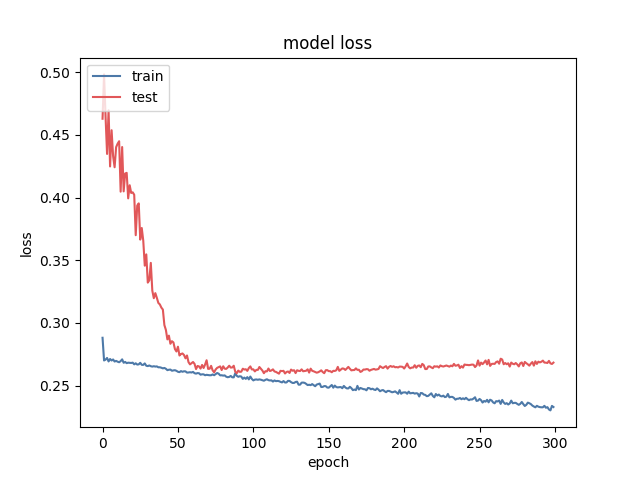
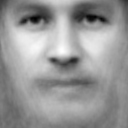

# Faceball
## Predicting success in the MLB based on facial features

Using a convolutional neural network and eigenfaces to determine key features that make a superstar.

### Purpose
If you’ve ever seen the movie, “Moneyball”, you've heard the old school scouts constantly saying that they like a player because “he has a good face”. They believe that the construction of a prospect’s facial features can determine his projectability into the big leagues. This time-honored way of thinking was somewhat discredited by the use of sabermetrics in the analysis of players, a system coined “moneyball.”

I took a deeper look into the data behind the old scouts’ way of thinking and ran a picture of every baseball player in history through a convolutional neural network in order to see if there really is a correlation between facial features and performance. There was in fact a direct trend, presented below.

Eigenfaces were also employed in order to combine all of the faces that make up the best players to produce the super player.

### Data and Image Processing
All of the images of the MLB players were scraped along with their total WAR stats. WAR stands for "Wins Above Replacement." A "replacement" is equivalent to a triple-A free agent (A player that is available and can be picked up on a whim when in need of a replacement). That being said, the total WAR values were divided by the number of years played by each player to obtain their average WAR over their career. A WAR of 0 means that the player produced 0 more wins than a replacement, meaning that he is an average ball player. A WAR of 5 or more (player produced 5 wins above what a replacement could produce) indicates that he is a perennial All-Star.

These images were fed through a facial detection process in order to crop and align each face to the center of a 128x128, greyscale image. Lastly, these projected face images were converted to numpy arrays, ready to be fed into the neural net. Below is an example of the raw image and the projected image.

    
    
    

### Neural Net
I implemented a fairly standard convolutional neural network. Will go into detail later...

#### Results

The classes were very imbalanced. About 68% of the data were 0's, 20% 1's, and decreasing as you go to 5. This imbalance coupled with the fact that facial features are only a very slight predictor of success, means that the accuracy of any model created will only decrease as the model starts to predict values other than 0. The goal of this model is to minimize the loss (reduce the prediction error). Any increase in accuracy is just a bonus.

    
You can see how the training loss continues to decrease as the model learns. The test loss decreases significantly up until 60 epochs and then begins to rise a bit, probably due to over fitting.

The main takeaway from this project can be shown in the following graph:

<img src="misc_images/sigmoid_binary_300_prediction_trend.png" alt="Prediction Trend Graph")

The images in the test set were divided up into their classes and the average model predictions were recorded. It is clear that the model's predictions on unseen data show a positive trend in facial features and success.

### Reconstructing the Perfect Player
Using Eigenfaces, a form of Principle Component Analysis, I was able to decompose the images of players in each class and reassemble them into 1 face. Here is the breakdown (0 on the left to 5 on the right).

What do you take away from these images? I think that the player with a WAR of 5 or higher looks more serious than the other players. Maybe the sign of greatness is a player's demeanor more than his facial makeup. The edges of the higher values players' faces also look more sharp than that of the lower valued players. A lot of this is interpretation but that's what it looks like to me. I'd love to hear what anybody else thinks about these pictures.

### Future Directions:

### See How Good You Could Be!
I made a website to take your image submissions and predict success using this model. You can find it at **http://ec2-52-91-17-204.compute-1.amazonaws.com:8105/**.

### References
This isn't the most relatable article to my project but it is kind of getting at the same thing.
http://rspb.royalsocietypublishing.org/content/275/1651/2651.short
It talks about how facial structure can determine an athlete's aggresiveness.
